# Product Requirements Document (PRD) — Version 3 (Canonical)
## Project: DealRadar — Headless Affiliate Aggregator, GEO & EU Compliance Platform

* **Status:** APPROVED — Ready for Execution
* **Version:** 3.0 (Supersedes v1 and v2)
* **Target Release:** Q3 2026
* **Owner:** Principal Architect & PM Team
* **Last Updated:** 2026-06-23
* **Source of Truth:** This document is the single canonical PRD. All other specs (`requirements.md`, `design.md`, `tasks.md`) derive from and must be traceable to this document.

---

## 1. Executive Summary & Vision

### Vision Statement
DealRadar is the premier European geo-located shopping companion, connecting consumers with verified, localized price reductions. This PRD defines the transformation from a visual, client-only catalog running on mock data to a fully automated, headless affiliate aggregator and AI-crawlable semantic database that captures both traditional web users and the emerging market of **autonomous AI consumers** (e.g., SearchGPT, Gemini, Perplexity) — while meeting every EU regulatory obligation from day one.

### Core Goals
1. **Automate Monetization:** Transition from static mock data to a programmatic data feed that deduplicates deals across networks and dynamically structures tracking links to monetize every outbound click.
2. **Generative Engine Optimization (GEO):** Structure page output so that AI bots crawl, verify, and cite DealRadar as their primary authority for European deal queries.
3. **True Local Scoping:** Deliver instant, cookie-driven server-side rendering (SSR) of localized content via edge IP detection, eliminating CLS.
4. **Regulatory & Legal Compliance:** Satisfy EU regulations (GDPR, German *Impressumspflicht*, Austrian TMG, ePrivacy Directive, German UWG/TTDSG, and affiliate disclosure requirements) programmatically with zero user friction.
5. **Operator-Ready Mock Fallback:** Maintain seamless local development without any API keys or database connections.

---

## 2. Problem Statement & Opportunities

### Current Pain Points (Verified Against Codebase)
| Pain Point | Evidence | Impact |
|---|---|---|
| **Mock Baseline** | Providers fall back to mock data when API keys are absent. No automated monetization links. | Zero revenue generation. |
| **No Shareable Deal Pages** | Deals open inside `DealDetailModal.tsx` (a React client-side modal). No URL-addressable deal pages exist. | Impossible for search engines or AI bots to index individual deals. |
| **Weak Attribution** | `affiliate.ts` only appends a static `'dealradar'` string as subID. No postback endpoint exists. No `transactions` table. | Cannot attribute sales to specific deals, categories, or countries. |
| **Cold Starts on Location** | `resolve.ts` uses a 3-tier client-side chain (localStorage → Browser Geolocation → `/api/geo` IP fallback). | Causes CLS on first load; bots see generic content. |
| **No Price History** | `price-history.ts` explicitly says *"When the daily refresh starts recording real snapshots (a price_history table), feed that recorded series"*. No such table exists. | Cannot make "90-day lowest" claims for AI proof fields. |
| **No Legal Pages** | No imprint, privacy, or terms pages exist. Footer has affiliate text only. | Non-compliant with German *Impressumspflicht* and GDPR. |
| **No Cookie Consent** | No cookie consent banner or CMP exists anywhere in the codebase. | Non-compliant with GDPR, ePrivacy Directive, and German TTDSG. |
| **No Unsubscribe in Emails** | `priceDropEmail()` in `alerts.repo.ts` sends emails with zero unsubscribe link or `List-Unsubscribe` header. | Violates GDPR Article 7(3), CAN-SPAM, and German UWG §7. |
| **Affiliate Disclosure Only in Footer** | Footer shows `t('affiliateDisclosure')` but no disclosure appears near deal links. | Insufficient per EU Directive 2005/29/EC and German UWG. |

### The Opportunity
By exposing structured Schema.org markup alongside automated database calculations (historic lows, price comparisons), DealRadar becomes a primary data source for AI search crawlers. AI agents reward highly formatted data that provides "proof" of assertions with canonical footnotes. Combined with full EU regulatory compliance, this positions DealRadar as a trustworthy, citable authority in the European deal aggregator space.

---

## 3. Product Scope & Core Pillars

The project is structured around **6 key technical pillars** plus a compliance layer:

```mermaid
graph TD
    A[DealRadar Core Platform] --> B["1. Headless Ingestion"]
    A --> C["2. Database Persistence & History"]
    A --> D["3. GEO Schema & Routing"]
    A --> E["4. Edge Location Scoping"]
    A --> F["5. Webhook Postbacks"]
    A --> G["6. Legal & GDPR Compliance"]

    B --> B1["Strackr unified API (provisional)"]
    B --> B2["Hybrid Deduplication Engine"]
    C --> C1["deals, price_history, transactions tables"]
    C --> C2["Postgres trigger for automated price snapshots"]
    D --> D1["/[locale]/deal/[slug] SSR page & JSON-LD"]
    D --> D2["Dynamic sitemap.xml & robots.txt"]
    E --> E1["Netlify/Vercel Edge headers → dr_location cookie"]
    E --> E2["Client-side resolve.ts as fallback"]
    F --> F1["api/postbacks commission attribution"]
    F --> F2["Structured subID tracking parameters"]
    G --> G1["Imprint, Privacy, Terms pages"]
    G --> G2["HMAC-signed email unsubscribe"]
    G --> G3["Cookie consent banner (FOSS)"]
    G --> G4["Affiliate-link disclosure badges"]
    G --> G5["IP-based rate limiting"]
```



---

## 4. User & Crawler Personas

### Persona A: The Deal Seeker (End User)
* **Goal:** Find the lowest price for a specific product in their country/city.
* **Need:** Accurate prices, real discount percentages, historical context ("90-day low"), and direct merchant links.
* **Compliance Expectation:** Clear affiliate disclosures, cookie consent, GDPR-compliant email handling.

### Persona B: The Generative Search Agent (AI Bot)
* **Goal:** Crawl the web looking for authoritative answers to queries like *"Where can I buy the Samsung S24 Ultra cheapest in Germany right now?"*
* **Need:** Dynamic JSON-LD markup with `Product` + `AggregateOffer` + `availability` + `itemCondition`, historical price verification, clean canonical links, and high sitemap visibility.

### Persona C: The Developer/PM (Operations)
* **Goal:** Run and test the codebase locally without active API keys or database connections.
* **Need:** Seamless mock-mode fallback when credentials are not configured in `.env`. All providers gracefully degrade.

---

## 5. Functional Requirements (EARS Notation)

> **Notation Key:** EARS = Easy Approach to Requirements Syntax.
> - **Event-driven:** "When [trigger], the system shall..."
> - **State-driven:** "While [state], the system shall..."
> - **Ubiquitous:** "The system shall..." (always applies)
> - **Unwanted Behavior:** "If [condition], then the system shall..."

### 5.1 Ingestion & Deduplication

* **FR-ING-1 (Event-driven):** When the Scheduled Refresher triggers a POST request to `/api/refresh` with valid `Bearer CRON_SECRET` authorization, the system shall fetch the latest regional deals from the unified Strackr API (endpoint TBD — to be verified in Phase 0).

* **FR-ING-2 (State-driven):** While importing deals from the API, the system shall normalize product details (name, prices, image URL, affiliate tracking link, network name, merchant name, EAN code) to fit the internal `NormalizedDeal` schema.

* **FR-ING-3 (Ubiquitous):** The system shall compute a dynamic discount percentage for each ingested deal based on `((original_price - sale_price) / original_price) * 100`, clamped to 0–100%.

* **FR-ING-4 (Unwanted Behavior — Hybrid Deduplication):** If the system identifies a duplicate product (sharing the same EAN barcode, or matching cleaned name + merchant keys when EAN is absent) across multiple networks, then the system shall:
  1. Prefer the deal that offers the **lower sale price** (deepest discount).
  2. If the sale prices are **equal**, prefer the network with the **highest priority** in the registry's priority order (Kelkoo > Tradedoubler > Awin).
  > **Design Decision:** This optimizes for user value. The source PRD suggested highest-commission; this was overridden after product review (see spec_audit.md D-1).

* **FR-ING-5 (Event-driven):** When saving deals to the database, the system shall run a bulk upsert that inserts new deals and updates existing records by matching on the primary key `product_id`.

* **FR-ING-6 (Event-driven — Price History Trigger):** When a deal's price is updated via upsert, the database trigger `trigger_record_price_history` shall automatically log a snapshot of the price change in the `price_history` table — but only if the price changed or if no snapshot exists for that product on the current calendar day.

* **FR-ING-7 (State-driven — 90-Day Low Cache):** While executing the daily refresh, the system shall calculate and update the cached `historical_low_price` on the `deals` table for all deals based on a 90-day window query of the `price_history` table.

* **FR-ING-8 (Event-driven — Alert Dispatch):** When a deal's price drops below the user's subscribed alert price during ingestion, the system shall dispatch a price-drop email alert to the subscriber and mark the alert as notified.

### 5.2 Routing, UX & SEO

* **FR-RTE-1 (Event-driven):** When a user clicks a deal tile on the home grid, the system shall route the browser to the dedicated SSR deal page `/[locale]/deal/[slug]` instead of launching a client-side modal.
  > **Migration Note:** The existing `DealDetailModal.tsx` shall be deprecated/deleted after the SSR page is confirmed working.

* **FR-RTE-2 (Event-driven):** When a request hits `/[locale]/deal/[slug]`, the page shall dynamically render:
  * Title: `[deal.productName] - Best Deal in [Country] | DealRadar`
  * Canonical alternate links mapped to the current locale path.
  * Schema.org JSON-LD with `Product`, `AggregateOffer`, `availability`, `itemCondition`, and `seller`.
  * Contextual "AI-Scrapable Proof Fields" (e.g., *"This product has reached its lowest price in 90 days"*, *"Verified at [timestamp] CET"*).
  * If deal is not found: call `notFound()` (not a bare div).

* **FR-RTE-3 (Event-driven):** When a client requests a sitemap, the system shall dynamically generate `/sitemap.xml` using Next.js `sitemap.ts` at the app root, yielding localized routes for all static pages, active categories, and active deals with `hreflang` alternates.

* **FR-RTE-4 (Event-driven):** When an AI crawler requests `/robots.txt`, the server shall output rules:
  * Allow all AI search agents (`OAI-SearchBot`, `PerplexityBot`, `Google-Extended`).
  * Disallow all API endpoints: `Disallow: /api/` (covers `/api/refresh`, `/api/postbacks`, `/api/alerts`, `/api/geo`).
  * Point to root sitemap: `Sitemap: https://dealradar.app/sitemap.xml`.

### 5.3 Geolocation & Middleware Scoping

* **FR-GEO-1 (Event-driven):** When a request lacks the `dr_location` cookie, the edge middleware shall resolve the visitor's country code using platform geo-forwarding headers (`X-NF-Country` on Netlify, `x-vercel-ip-country` on Vercel) and set the `dr_location` response cookie.
  > **Architecture Note:** The existing client-side `resolve.ts` chain (localStorage → Browser Geolocation → `/api/geo`) remains as a **fallback** for when edge headers are absent (local dev, non-Netlify/Vercel hosts). The edge approach is the primary mechanism for production to prevent CLS.

* **FR-GEO-2 (Unwanted Behavior):** If the resolved country is not supported by DealRadar, then the system shall write a default country code (`DE`) to the `dr_location` cookie.

### 5.4 Transaction Attributes & Postbacks

* **FR-TRK-1 (Ubiquitous):** The system shall construct affiliate links with a programmatically appended single unified subID structured as `dealradar_${country}_${category}_${productId}` (e.g., `dealradar_DE_electronics_kelkoo:12345`) mapped to the network's custom tracking parameter:
  * Kelkoo: `custom1`
  * Awin: `clickref`
  * Tradedoubler: `epi`
  > **Rationale:** Single-parameter format prevents data loss on networks supporting only one custom field.

* **FR-TRK-2 (Event-driven):** When the serverless postback listener (`/api/postbacks`) receives a transaction ping, the system shall:
  1. Validate the request query parameter signature (`secret`) matches `WEBHOOK_SECRET`.
  2. Parse the subID to extract the `productId`.
  3. Query the database for the matching `product_id`.
  4. Record the commission event in the `transactions` table.
  5. The `transactions` table shall store **no PII** (no IP addresses, no user account details).

### 5.5 Legal Compliance & Privacy

* **FR-COMP-1 (Ubiquitous — Legal Pages):** The system shall provide localized footer links to mandatory legal pages: **Imprint (Impressum)**, **Privacy Policy**, and **Terms of Service**, plus a **Cookie Settings** link.

* **FR-COMP-2 (Ubiquitous — Affiliate Disclosure):** The system shall display a visible "Affiliate-Link" or "Werbung" badge/tooltip **adjacent to every outbound affiliate link** on DealCard components and the SSR deal detail page CTA button. Footer-only disclosure is **insufficient** per German UWG and EU Directive 2005/29/EC.

* **FR-COMP-3 (Event-driven — Email Unsubscribe):** When a price alert email is dispatched, the system shall:
  1. Append a visible "Unsubscribe" link in the email HTML footer.
  2. The link shall point to `/api/alerts/unsubscribe?email=...&productId=...&token=...` where `token` is an HMAC SHA-256 hash of `email:productId` signed with `CRON_SECRET`.
  3. Include `List-Unsubscribe` and `List-Unsubscribe-Post` email headers per RFC 8058.

* **FR-COMP-4 (Event-driven — Unsubscribe Verification):** When the unsubscribe route receives a validated token request, the system shall delete the matching user subscription from the `price_alerts` table, satisfying GDPR Article 17 (Right to Erasure).

* **FR-COMP-5 (Event-driven — Rate Limiting):** When a user submits an alert signup request, the system shall enforce rate-limiting of **5 requests/hour per IP** using Upstash Redis to prevent abuse.

* **FR-COMP-6 (Ubiquitous — Cookie Consent):** The system shall display a GDPR-compliant cookie consent banner using `vanilla-cookieconsent` (by Orest Bida — FOSS, zero-cost, ~10KB gzipped). Categories: Essential (always on), Analytics (opt-in). Supports Google Consent Mode v2.

---

## 6. Non-Functional Requirements (NFRs)

### Performance & Scaling
* **NFR-PERF-1:** Main page routing and list queries must maintain sub-100ms response times by caching outputs on Upstash Redis with a maximum TTL of 30 minutes.
* **NFR-PERF-2:** Database queries on product name, brand, and slugs must utilize Postgres GIN/B-tree indices to prevent full-table scans.
* **NFR-PERF-3:** Serverless ingestion routes (`/api/refresh`) must complete execution within serverless execution limits (`maxDuration = 300`).

### Security & Privacy
* **NFR-SEC-1:** `/api/refresh` requires `Bearer CRON_SECRET`. `/api/postbacks` requires `secret` query parameter matching `WEBHOOK_SECRET`.
* **NFR-SEC-2:** Database RLS must remain enabled on all tables. Application connects server-side only using the Supabase Service Role key.
* **NFR-SEC-3:** Geographic coordinates used for geolocation reverse-lookup must be handled transiently and never persisted.
* **NFR-PRIV-1 (Data Minimization):** The `transactions` table must not store any PII. The `price_alerts` table stores email PII but implements automated secure deletion via the unsubscribe endpoint.

### Tech Stack Constraints
* **NFR-TECH-1:** Backend: Node.js 20 with TypeScript.
* **NFR-TECH-2:** Persistence: Supabase PostgreSQL.
* **NFR-TECH-3:** Frontend: Next.js 14 App Router + `next-intl` for localization.
* **NFR-TECH-4:** Cache: Upstash Redis (REST API).
* **NFR-TECH-5:** Email: Resend transactional email API.
* **NFR-TECH-6:** Deployment: Netlify (with `@netlify/plugin-nextjs`).
* **NFR-TECH-7 (CRITICAL PRAGMATISM):** Use pre-built/FOSS solutions over custom implementations where available (e.g., `vanilla-cookieconsent` for GDPR consent, not a custom banner).

---

## 7. Key Architecture & Data Models

### 7.1 Database Schema Updates

Three structural changes to the Supabase PostgreSQL database:

| Change | Description |
|---|---|
| **Modify `deals` table** | Add columns: `affiliate_network`, `native_product_id`, `merchant_name`, `ean_code`, `tracking_url`, `description`, `historical_low_price`, `slug` |
| **New `price_history` table** | Time-series of price snapshots per product, populated by a Postgres trigger on `deals.sale_price` changes |
| **New `transactions` table** | Anonymous commission records from postback webhooks (no PII) |

> **⚠️ Data Integrity Note:** The `price_history` table uses `ON DELETE CASCADE` on `product_id`. If a deal is hard-deleted (e.g., by the optional 24h stale purge cron commented in `schema.sql`), all associated price history is permanently lost. For MVP, this is acceptable. For production scale, consider a soft-delete `is_active` flag on `deals` or changing the FK to `ON DELETE SET NULL`.

### 7.2 Schema.org Integration (JSON-LD)

Every deal page (`/[locale]/deal/[slug]`) must output a valid JSON-LD block:

```json
{
  "@context": "https://schema.org",
  "@type": "Product",
  "name": "Samsung Galaxy S24 Ultra",
  "image": "https://images.affiliatecdn.com/samsung-s24.jpg",
  "description": "Save 27% on Samsung Galaxy S24 Ultra. Verified lowest price in 90 days.",
  "offers": {
    "@type": "AggregateOffer",
    "priceCurrency": "EUR",
    "lowPrice": "1049.00",
    "highPrice": "1449.00",
    "offerCount": "1",
    "availability": "https://schema.org/InStock",
    "offers": [
      {
        "@type": "Offer",
        "price": "1049.00",
        "priceCurrency": "EUR",
        "availability": "https://schema.org/InStock",
        "itemCondition": "https://schema.org/NewCondition",
        "url": "https://dealradar.app/en/deal/samsung-galaxy-s24-ultra-kelkoo-12345",
        "seller": {
          "@type": "Organization",
          "name": "Samsung DE"
        },
        "priceSpecification": {
          "@type": "PriceSpecification",
          "price": "1049.00",
          "priceCurrency": "EUR",
          "valueAddedTaxIncluded": "true"
        }
      }
    ]
  }
}
```

> **Required fields per 2025/2026 best practices:** `availability` (required for Google rich results), `itemCondition` (recommended). `priceValidUntil` is omitted because deal prices have no fixed expiry.

### 7.3 Existing Architecture Preserved

| Component | Current State | Status |
|---|---|---|
| Provider Registry Pattern | `registry.ts` with `PriceProvider` interface | ✅ Preserved |
| Mock Fallback | All providers return `{ ok: true, isMock: true }` when keys absent | ✅ Preserved |
| Redis Cache | `redis.ts` with graceful degradation (no-op when env vars absent) | ✅ Preserved |
| Resend Email | `send.ts` with fallback logging when `RESEND_API_KEY` absent | ✅ Preserved |
| i18n Routing | `next-intl` with 13 locales, `localePrefix: 'always'` | ✅ Preserved |
| RLS on all tables | `schema.sql` enables RLS on `deals` and `price_alerts` | ✅ Extended to new tables |

---

## 8. Risks, Assumptions & Mitigations

| Risk | Impact | Mitigation Strategy |
|---|---|---|
| **Strackr API Rate Limits / Failure** | High | Pipeline logs a `ProviderError` and aborts, leaving existing DB rows intact. Old deals purge on a rolling 24h cycle. |
| **Missing Barcodes (EANs)** | Medium | Deduplication falls back to composite key: `slugify(name)_slugify(merchant)`. |
| **Alert/Email Spamming** | Medium | Rate-limiting (5/hr/IP) via Upstash Redis + HMAC-signed unsubscribe tokens. |
| **Strackr Endpoint/Payload Schema Unknown** | Medium | Endpoint and payload marked **provisional** in design.md. Phase 0 task validates against real Strackr docs before implementation. |
| **Price History Data Loss on Hard Deletes** | Medium | `ON DELETE CASCADE` on `price_history` FK. Documented for conscious acceptance or soft-delete migration. |
| **GDPR Consent Enforcement** | High | Cookie consent banner (FOSS `vanilla-cookieconsent`), automated unsubscribe, data minimization in `transactions`. |

### Assumptions
1. `STRACKR_API_KEY` is active with permissions for DACH and wider European regions.
2. Resend email sender is configured and verified for the sender domain.
3. Deployment platform (Netlify/Vercel) supports geo-forwarding headers.
4. Legal counsel has approved the Imprint, Privacy, and Terms copy for the applicable jurisdictions.

---

## 9. Deliverable Buckets

### 9.1 User-Driven Deliverables (End-User Value)

These are features the end-user directly interacts with or benefits from:

| # | Deliverable | Expected Outcome | Acceptance Criteria |
|---|---|---|---|
| U-1 | **SSR Deal Detail Page** | User clicks a deal card → navigates to a dedicated URL-addressable page with full product info, price history context, and CTA button | Page renders at `/[locale]/deal/[slug]`. Returns 404 via `notFound()` for invalid slugs. Contains valid JSON-LD in page source. |
| U-2 | **Real-Time Deal Prices** | User sees actual, live-aggregated prices from real affiliate networks — not mock data | `/api/refresh` successfully fetches, deduplicates, and upserts live deals. Discount percentages are dynamically calculated. |
| U-3 | **Price Drop Email Alerts** | User subscribes to a price alert → receives email when price drops below threshold | Email arrives with correct price info, visible unsubscribe link, and `List-Unsubscribe` header. Rate-limited to 5/hr/IP. |
| U-4 | **Geo-Localized Content** | User sees deals scoped to their country automatically on first visit | `dr_location` cookie set by edge middleware. No CLS from client-side geo detection on production. |
| U-5 | **Legal Pages** | User can access Imprint, Privacy Policy, Terms of Service from the footer | Pages render at `/[locale]/imprint`, `/[locale]/privacy`, `/[locale]/terms`. Content is localized. Footer links are present. |
| U-6 | **Cookie Consent** | User sees a GDPR-compliant consent banner on first visit | Banner appears with equal Accept/Reject options. Preference persists. Non-essential cookies blocked until consent. |
| U-7 | **Affiliate Disclosure** | User sees visible "Affiliate-Link" badge on deal cards and detail page | Badge/tooltip is adjacent to every outbound CTA link, not just in the footer. |

### 9.2 Product-Driven Deliverables (Business Value)

These directly serve monetization and competitive positioning:

| # | Deliverable | Expected Outcome | Acceptance Criteria |
|---|---|---|---|
| P-1 | **Structured SubID Tracking** | Every outbound click carries `dealradar_${country}_${category}_${productId}` | Inspect outbound URLs and verify tracking parameter is appended for each network's specific param name. |
| P-2 | **Postback Webhook Endpoint** | Commission events from affiliate networks are captured and attributed | POST to `/api/postbacks` with valid `secret` writes to `transactions` table. Invalid requests return 401. |
| P-3 | **GEO Schema.org Markup** | AI search engines cite DealRadar as a data source | Every deal page has valid JSON-LD with `Product`, `AggregateOffer`, `availability`, `itemCondition`. Validated via Schema.org Validator. |
| P-4 | **Dynamic Sitemap** | All active deals are discoverable by search engines and AI bots | `/sitemap.xml` returns valid XML with localized `hreflang` alternates for all active deals. |
| P-5 | **AI-Scrapable Proof Fields** | AI bots extract historic low prices and verification timestamps | Deal page contains visible text: "Lowest price in 90 days" and "Verified at [timestamp] CET". |
| P-6 | **Price History Tracking** | 90-day price trend data supports proof claims | `price_history` table is populated by database trigger. `historical_low_price` column cached and updated daily. |

### 9.3 Value-Driven Deliverables (Operational/Technical Value)

These ensure system reliability, security, and developer experience:

| # | Deliverable | Expected Outcome | Acceptance Criteria |
|---|---|---|---|
| V-1 | **Hybrid Deduplication** | No duplicate deals displayed to users | Deduplication groups by EAN → name+merchant. Keeps lowest price; breaks ties by priority. Verified by unit tests. |
| V-2 | **Database Migrations** | Schema supports all new features | `price_history`, `transactions` tables created. Trigger registered. RLS enabled. Indexes added. |
| V-3 | **API Security** | No unauthorized access to admin endpoints | `/api/refresh` rejects requests without `Bearer CRON_SECRET`. `/api/postbacks` rejects without `secret` param. |
| V-4 | **GDPR Right to Erasure** | Automated deletion of user data on request | Valid HMAC-signed unsubscribe link deletes row from `price_alerts`. Invalid tokens return error. |
| V-5 | **Mock Fallback Preserved** | App runs locally without any external services | `pnpm dev` starts successfully with empty `.env.local`. All providers return mock data. Redis no-ops. Email logs to console. |
| V-6 | **Zero Build Errors** | Production build completes successfully | `pnpm build` exits with code 0. No TypeScript compilation errors. |
| V-7 | **robots.txt Configuration** | Correct bot allowances and API exclusions | `Disallow: /api/` blocks all API routes. AI bots are allowed. Sitemap URL is correct. |

---

## 10. Success Metrics & KPIs

| Metric | Target | Measurement Method |
|---|---|---|
| **AI Indexation** | Growth in referrals from Perplexity/SearchGPT within 90 days of launch | Analytics tracking of referral sources |
| **Core Web Vitals** | LCP < 2.5s, CLS = 0.0 | Lighthouse/PageSpeed Insights audit |
| **Monetization Yield** | First tracked commission within 30 days of live provider activation | `transactions` table contains at least one `approved` record |
| **Compliance Status** | Pass manual audit for GDPR, Impressum, cookie consent | Checklist verification of all FR-COMP requirements |
| **Build Health** | Zero TypeScript errors on `pnpm build` | CI/CD pipeline exit code |
| **Schema Validity** | All deal pages pass Schema.org Rich Results Test | Automated validation of JSON-LD output |

---

## 11. Out of Scope (Explicit Exclusions)

These are explicitly NOT part of this release:

1. **Community Features** — User voting, comments, deal submissions (MyDealz/Pepper-style).
2. **User Accounts / Authentication** — No login, registration, or user profiles.
3. **Direct Merchant API Integrations** — We use Strackr as the aggregator; individual network APIs (Awin, Tradedoubler, Kelkoo) are existing providers, not new integrations.
4. **Accounting/Invoice Automation** — Mentioned in source PRD Phase 4; deferred to a future release.
5. **Mobile Native Apps** — Web-only for this release.
6. **A/B Testing / Personalization** — Deferred.

---

## 12. Glossary

| Term | Definition |
|---|---|
| **EAN** | European Article Number — 13-digit barcode used for product deduplication |
| **GEO** | Generative Engine Optimization — structuring content for AI crawler consumption |
| **JSON-LD** | JavaScript Object Notation for Linked Data — structured data format for Schema.org |
| **HMAC** | Hash-based Message Authentication Code — cryptographic signature for secure tokens |
| **RLS** | Row-Level Security — Supabase/Postgres feature restricting data access |
| **CLS** | Cumulative Layout Shift — Core Web Vital measuring visual stability |
| **LCP** | Largest Contentful Paint — Core Web Vital measuring loading performance |
| **UWG** | Gesetz gegen den unlauteren Wettbewerb — German Unfair Competition Act |
| **TTDSG** | Telekommunikation-Telemedien-Datenschutz-Gesetz — German data protection for telecom/telemedia |
| **CMP** | Consent Management Platform — tool for managing cookie consent |
| **SubID** | Sub-Identifier — tracking parameter appended to affiliate URLs for attribution |
